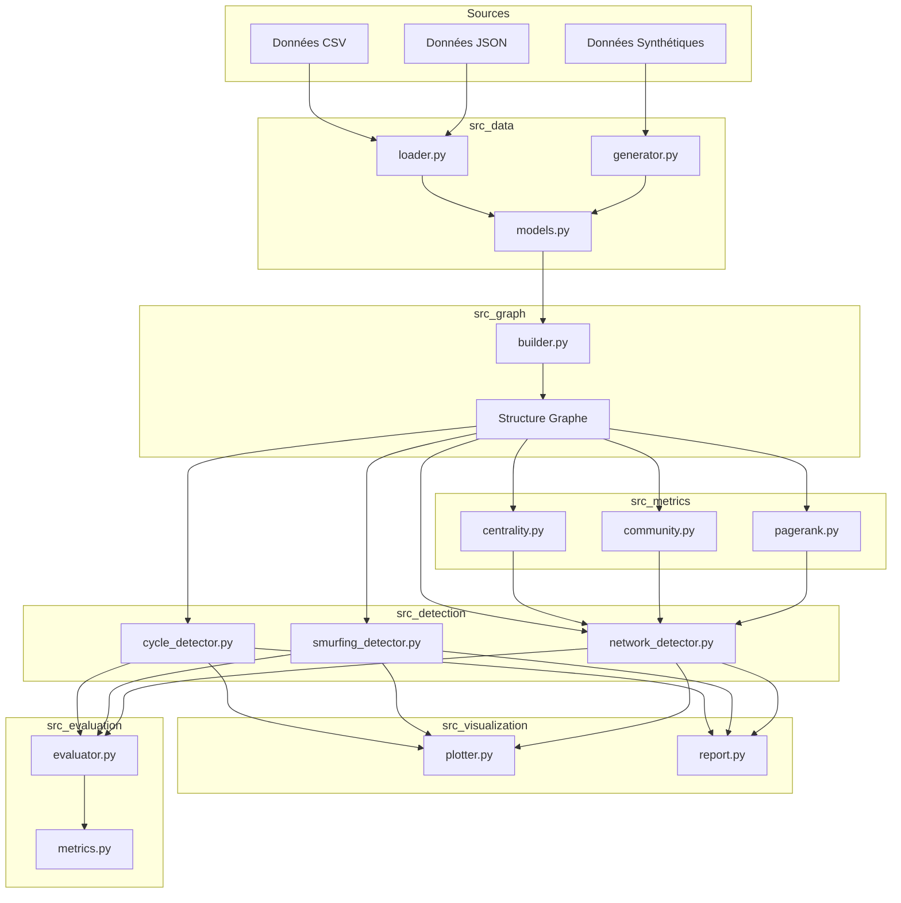
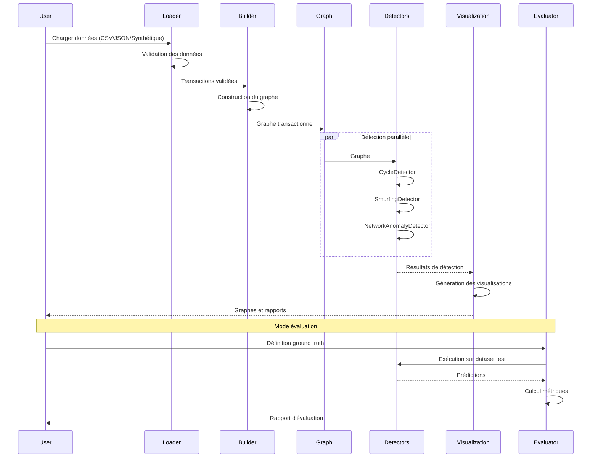
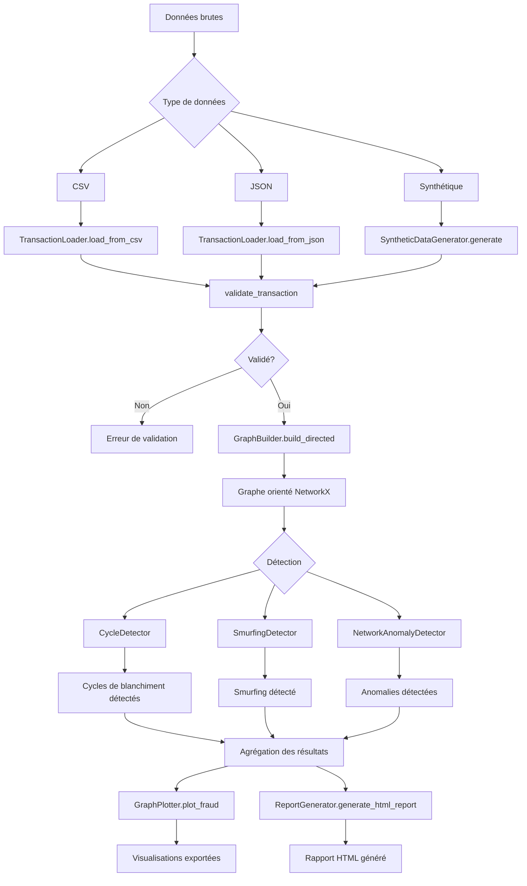
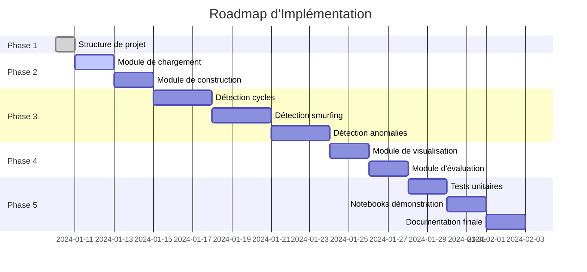

# Architecture Technique - Détection de Fraude Financière par Graphes

---

## 📋 Informations du Projet

| **Item** | **Valeur** |
|----------|------------|
| **Numéro de groupe** | 42 |
| **Membres** | Malak El Idrissi, Joe Boueri |
| **Cours** | IA Exploratoire et Symbolique - ECE |
| **Sujet** | Détection de fraude financière par graphes |
| **Version** | 1.0 |
| **Date** | Janvier 2026 |

---

## 1. Choix Technologique Final

### 1.1 Stack Technologique Principale

| **Composant** | **Technologie** | **Justification** |
|---------------|-----------------|-------------------|
| **Langage** | Python 3.10+ | Langage standard pour le data science, excellent support pour les bibliothèques scientifiques |
| **Bibliothèque de graphes** | NetworkX | Bibliothèque Python pure, simple à installer, excellente documentation, adaptée aux datasets académiques (10k-100k transactions) |
| **Manipulation de données** | Pandas | Standard de facto pour le traitement de données tabulaires en Python |
| **Visualisation** | Matplotlib | Visualisation statique de qualité, compatible avec Jupyter notebooks |
| **Calcul numérique** | NumPy | Calcul vectoriel optimisé pour les algorithmes de graphes |
| **Environnement** | Jupyter Notebook | Expérimentation interactive et démonstration pédagogique |

### 1.2 Pourquoi NetworkX et non Neo4j ?

| **Critère** | **NetworkX** | **Neo4j** |
|-------------|--------------|-----------|
| **Complexité d'installation** | `pip install networkx` | Installation serveur + driver + configuration |
| **Courbe d'apprentissage** | API Python simple | Langage Cypher à apprendre |
| **Démonstration** | Exécution dans notebook Jupyter | Démo nécessite serveur actif |
| **Volume de données** | Optimal jusqu'à ~100k nœuds | Nécessaire pour millions+ de nœuds |
| **Vitesse de développement** | Rapide (bibliothèque pure Python) | Plus lente (infrastructure à configurer) |
| **Portabilité** | Code portable, pas de dépendance externe | Dépendance serveur, moins portable |
| **Adéquation projet académique** | **Excellent** | Surdimensionné |

**Conclusion** : Pour ce projet académique avec des volumes de données modérés et un objectif pédagogique, **NetworkX est le choix optimal**. Il permet de se concentrer sur les algorithmes de détection plutôt que sur l'infrastructure.

### 1.3 Dépendances Python

```txt
networkx>=3.0
pandas>=2.0
matplotlib>=3.7
numpy>=1.24
scipy>=1.10
```

---

## 2. Structure des Dossiers

```
42. Détection de fraude financière par graphes/
│
├── src/                           # Code source principal
│   ├── __init__.py
│   ├── fraud_detector.py          # Point d'entrée principal
│   │
│   ├── data/                      # Module de chargement des données
│   │   ├── __init__.py
│   │   ├── loader.py              # Chargement depuis fichiers (CSV, JSON)
│   │   ├── generator.py           # Génération de données synthétiques
│   │   └── models.py              # Modèles de données (Transaction, Compte)
│   │
│   ├── graph/                     # Module de construction de graphes
│   │   ├── __init__.py
│   │   ├── builder.py             # Construction du graphe transactionnel
│   │   └── utils.py               # Utilitaires de graphes
│   │
│   ├── detection/                 # Module de détection de fraudes
│   │   ├── __init__.py
│   │   ├── base.py                # Classe abstraite de détecteur
│   │   ├── cycle_detector.py      # Détection de cycles de blanchiment
│   │   ├── smurfing_detector.py   # Détection de smurfing
│   │   └── network_detector.py    # Détection d'anomalies de réseaux
│   │
│   ├── metrics/                   # Module d'analyse et de métriques
│   │   ├── __init__.py
│   │   ├── centrality.py          # Métriques de centralité
│   │   ├── community.py           # Détection de communautés
│   │   └── pagerank.py            # Calcul de PageRank
│   │
│   ├── visualization/             # Module de visualisation
│   │   ├── __init__.py
│   │   ├── plotter.py             # Visualisation des graphes
│   │   └── report.py              # Génération de rapports
│   │
│   └── evaluation/                # Module d'évaluation
│       ├── __init__.py
│       ├── evaluator.py           # Évaluation des détecteurs
│       └── metrics.py             # Métriques de performance
│
├── data/                          # Jeux de données
│   ├── synthetic/                 # Données générées
│   │   ├── small_dataset.csv      # Dataset de test (~1000 transactions)
│   │   ├── medium_dataset.csv     # Dataset de démonstration (~10000 transactions)
│   │   └── large_dataset.csv      # Dataset de validation (~50000 transactions)
│   │
│   ├── real/                      # Données réelles (si disponibles)
│   │   └── .gitkeep
│   │
│   └── ground_truth/              # Annotations pour l'évaluation
│       ├── small_labels.csv
│       └── medium_labels.csv
│
├── notebooks/                     # Jupyter notebooks pour exploration
│   ├── 01_exploration.ipynb       # Exploration des données
│   ├── 02_graph_construction.ipynb  # Construction de graphes
│   ├── 03_cycle_detection.ipynb   # Détection de cycles
│   ├── 04_smurfing_detection.ipynb # Détection de smurfing
│   ├── 05_network_anomalies.ipynb # Anomalies de réseaux
│   └── 06_visualization.ipynb     # Visualisations avancées
│
├── tests/                         # Tests unitaires
│   ├── __init__.py
│   ├── test_loader.py
│   ├── test_graph_builder.py
│   ├── test_cycle_detector.py
│   ├── test_smurfing_detector.py
│   ├── test_network_detector.py
│   └── test_evaluation.py
│
├── docs/                          # Documentation technique
│   ├── ARCHITECTURE.md            # Ce document
│   ├── API.md                     # Documentation de l'API
│   └── GUIDE_UTILISATION.md       # Guide d'utilisation
│
├── slides/                        # Support de présentation
│   ├── slides.md                  # Structure des slides
│   ├── images/                    # Images et diagrammes pour présentation
│   └── export/                    # PDF/PPT exportés
│
├── plans/                         # Plans et spécifications
│   └── .gitkeep
│
├── requirements.txt               # Dépendances Python
├── setup.py                       # Script d'installation
├── .gitignore                     # Fichiers ignorés par Git
├── README.md                      # Présentation du projet
└── RECHERCHE.md                   # Document de recherche

```

---

## 3. Architecture des Composants

### 3.1 Vue d'Ensemble



### 3.2 Module de Chargement des Données (`src/data/`)

#### Classes et Fonctions

| **Fichier** | **Composant** | **Responsabilité** |
|-------------|---------------|-------------------|
| `models.py` | `Transaction` | Modèle représentant une transaction (id, expéditeur, destinataire, montant, date) |
| `models.py` | `Compte` | Modèle représentant un compte (id, propriétaire, type) |
| `loader.py` | `TransactionLoader` | Chargement de transactions depuis fichiers CSV/JSON |
| `loader.py` | `validate_transaction()` | Validation des données transactionnelles |
| `generator.py` | `SyntheticDataGenerator` | Génération de données synthétiques avec patterns de fraude |
| `generator.py` | `generate_cycles()` | Génération de cycles de blanchiment |
| `generator.py` | `generate_smurfing()` | Génération de patterns de smurfing |
| `generator.py` | `generate_network_anomalies()` | Génération d'anomalies de réseaux |

#### Interface Exemple

```python
class TransactionLoader:
    def load_from_csv(self, path: str) -> List[Transaction]:
        """Charge les transactions depuis un fichier CSV."""
        pass
    
    def load_from_json(self, path: str) -> List[Transaction]:
        """Charge les transactions depuis un fichier JSON."""
        pass

class SyntheticDataGenerator:
    def generate(
        self, 
        n_transactions: int, 
        include_fraud: bool = True
    ) -> List[Transaction]:
        """Génère des transactions synthétiques."""
        pass
```

### 3.3 Module de Construction de Graphes (`src/graph/`)

#### Classes et Fonctions

| **Fichier** | **Composant** | **Responsabilité** |
|-------------|---------------|-------------------|
| `builder.py` | `GraphBuilder` | Construction du graphe transactionnel |
| `builder.py` | `build_temporal_graph()` | Construction de graphe avec dimension temporelle |
| `builder.py` | `build_weighted_graph()` | Construction de graphe pondéré par montants |
| `utils.py` | `add_node_attributes()` | Ajout d'attributs aux nœuds |
| `utils.py` | `add_edge_attributes()` | Ajout d'attributs aux arêtes |
| `utils.py` | `filter_by_amount()` | Filtrage par montant |

#### Structure du Graphe

- **Nœuds** : Comptes bancaires
- **Arêtes** : Transactions entre comptes
- **Attributs des nœuds** :
  - `id` : Identifiant unique du compte
  - `propriétaire` : Propriétaire du compte
  - `type` : Type de compte (particulier, entreprise, etc.)
  - `degré_entrant` : Nombre de transactions reçues
  - `degré_sortant` : Nombre de transactions émises
  - `solde_cumulé` : Solde cumulé des transactions

- **Attributs des arêtes** :
  - `transaction_id` : Identifiant de la transaction
  - `montant` : Montant de la transaction
  - `timestamp` : Horodatage
  - `type` : Type de transaction (virement, prélèvement, etc.)

#### Interface Exemple

```python
class GraphBuilder:
    def build(self, transactions: List[Transaction]) -> nx.Graph:
        """Construit un graphe à partir de transactions."""
        pass
    
    def build_directed(self, transactions: List[Transaction]) -> nx.DiGraph:
        """Construit un graphe orienté."""
        pass
    
    def build_temporal(self, transactions: List[Transaction]) -> List[nx.DiGraph]:
        """Construit une série de graphes temporels."""
        pass
```

### 3.4 Module de Détection de Cycles de Blanchiment (`src/detection/cycle_detector.py`)

#### Description
Les cycles de blanchiment sont des boucles de transferts visant à masquer l'origine des fonds. Le détecteur identifie ces cycles dans le graphe transactionnel.

#### Algorithme
1. Détection des cycles élémentaires dans le graphe orienté
2. Filtrage des cycles par longueur (minimum 3 nœuds)
3. Calcul du score de suspicion basé sur :
   - Durée du cycle (temps entre première et dernière transaction)
   - Montant total transité
   - Régularité des montants (transactions égales = suspect)

#### Classes et Fonctions

| **Composant** | **Responsabilité** |
|---------------|-------------------|
| `CycleDetector` | Classe principale de détection de cycles |
| `detect_cycles()` | Détection de tous les cycles dans le graphe |
| `detect_simple_cycles()` | Détection de cycles élémentaires (sans répétition de nœuds) |
| `calculate_cycle_score()` | Calcul du score de suspicion d'un cycle |
| `filter_suspicious_cycles()` | Filtrage des cycles suspects |

#### Paramètres de Configuration

```python
CycleConfig:
    min_cycle_length: int = 3      # Longueur minimale d'un cycle
    max_cycle_length: int = 10     # Longueur maximale d'un cycle
    max_duration_hours: int = 72   # Durée maximale en heures
    min_amount_threshold: float = 1000  # Seuil minimum de montant total
    score_threshold: float = 0.7   # Seuil de score de suspicion
```

#### Interface Exemple

```python
class CycleDetector:
    def __init__(self, config: CycleConfig):
        self.config = config
    
    def detect(self, graph: nx.DiGraph) -> List[CycleFraud]:
        """Détecte les cycles de blanchiment dans le graphe."""
        pass
    
    def visualize_cycle(self, cycle: CycleFraud) -> Figure:
        """Visualise un cycle détecté."""
        pass
```

### 3.5 Module de Détection de Smurfing (`src/detection/smurfing_detector.py`)

#### Description
Le smurfing (schtroumpfage) consiste à fractionner un montant en plusieurs petites transactions vers un compte pivot.

#### Algorithme
1. Identification des nœuds recevant un nombre élevé de transactions
2. Analyse des montants entrants vers chaque nœud
3. Détection de patterns de fractionnement :
   - Multiples transactions de montants similaires
   - Montants inférieurs à un seuil de déclaration
   - Transactions provenant de comptes distincts
4. Calcul du score de suspicion

#### Classes et Fonctions

| **Composant** | **Responsabilité** |
|---------------|-------------------|
| `SmurfingDetector` | Classe principale de détection de smurfing |
| `detect_smurfing()` | Détection de patterns de smurfing |
| `find_pivot_accounts()` | Identification des comptes pivots potentiels |
| `analyze_incoming_amounts()` | Analyse des montants entrants |
| `calculate_fraction_score()` | Calcul du score de fractionnement |

#### Paramètres de Configuration

```python
SmurfingConfig:
    min_incoming_transactions: int = 5      # Nombre minimum de transactions entrantes
    max_transaction_amount: float = 10000   # Montant maximum par transaction
    amount_variance_threshold: float = 0.3  # Variance maximale entre montants
    distinct_senders_threshold: int = 3     # Nombre minimum d'expéditeurs distincts
    score_threshold: float = 0.6            # Seuil de score de suspicion
```

#### Interface Exemple

```python
class SmurfingDetector:
    def __init__(self, config: SmurfingConfig):
        self.config = config
    
    def detect(self, graph: nx.DiGraph) -> List[SmurfingFraud]:
        """Détecte les patterns de smurfing dans le graphe."""
        pass
```

### 3.6 Module de Détection d'Anomalies de Réseaux (`src/detection/network_detector.py`)

#### Description
Ce module détecte les anomalies dans la structure des réseaux transactionnels en utilisant les métriques de centralité et la détection de communautés.

#### Algorithme
1. Calcul des métriques de centralité (PageRank, betweenness, eigenvector)
2. Identification des nœuds atypiques (outliers statistiques)
3. Détection de communautés (Louvain, Girvan-Newman)
4. Analyse des ponts et des articulations
5. Détection des étoiles (hub-and-spoke patterns)

#### Classes et Fonctions

| **Composant** | **Responsabilité** |
|---------------|-------------------|
| `NetworkAnomalyDetector` | Classe principale de détection d'anomalies |
| `detect_central_outliers()` | Détection d'outliers par centralité |
| `detect_hub_patterns()` | Détection de patterns hub-and-spoke |
| `detect_bridges()` | Détection des ponts critiques |
| `detect_isolated_clusters()` | Détection de clusters isolés |
| `detect_fast_accounts()` | Détection de comptes avec activité anormalement rapide |

#### Paramètres de Configuration

```python
NetworkAnomalyConfig:
    centrality_method: str = 'pagerank'      # Méthode de centralité
    outlier_threshold: float = 2.5           # Écart-type pour outliers
    hub_degree_threshold: int = 20           # Degré minimum pour hub
    bridge_betweenness_threshold: float = 0.5 # Seuil de betweenness
    community_algorithm: str = 'louvain'     # Algorithme de communautés
```

#### Interface Exemple

```python
class NetworkAnomalyDetector:
    def __init__(self, config: NetworkAnomalyConfig):
        self.config = config
    
    def detect(self, graph: nx.DiGraph) -> List[NetworkAnomaly]:
        """Détecte les anomalies de réseaux dans le graphe."""
        pass
```

### 3.7 Module de Métriques (`src/metrics/`)

#### `centrality.py`
| **Fonction** | **Description** |
|--------------|-----------------|
| `calculate_pagerank()` | Calcule le PageRank des nœuds |
| `calculate_betweenness()` | Calcule la centralité de médiation |
| `calculate_eigenvector()` | Calcule la centralité de vecteur propre |
| `calculate_degree_centrality()` | Calcule la centralité de degré |

#### `community.py`
| **Fonction** | **Description** |
|--------------|-----------------|
| `detect_communities_louvain()` | Détection de communautés via Louvain |
| `detect_communities_girvan_newman()` | Détection via Girvan-Newman |
| `calculate_modularity()` | Calcule la modularité des communautés |

#### `pagerank.py`
| **Fonction** | **Description** |
|--------------|-----------------|
| `compute_pagerank()` | Implémentation PageRank avec paramètres personnalisés |
| `get_top_nodes()` | Retourne les nœuds avec le plus haut PageRank |

### 3.8 Module de Visualisation (`src/visualization/`)

#### Classes et Fonctions

| **Fichier** | **Composant** | **Responsabilité** |
|-------------|---------------|-------------------|
| `plotter.py` | `GraphPlotter` | Visualisation des graphes |
| `plotter.py` | `plot_fraud()` | Visualisation d'une fraude détectée |
| `plotter.py` | `plot_subgraph()` | Visualisation d'un sous-graphe |
| `plotter.py` | `plot_centrality_distribution()` | Distribution de centralité |
| `report.py` | `ReportGenerator` | Génération de rapports |
| `report.py` | `generate_html_report()` | Rapport en HTML |
| `report.py` | `generate_summary()` | Résumé des détections |

#### Interface Exemple

```python
class GraphPlotter:
    def plot_graph(self, graph: nx.Graph, save_path: str = None):
        """Affiche le graphe complet."""
        pass
    
    def highlight_fraud(self, graph: nx.DiGraph, fraud: FraudType, save_path: str = None):
        """Met en évidence les éléments frauduleux."""
        pass
```

### 3.9 Module d'Évaluation (`src/evaluation/`)

#### Classes et Fonctions

| **Fichier** | **Composant** | **Responsabilité** |
|-------------|---------------|-------------------|
| `evaluator.py` | `FraudEvaluator` | Évaluation des détecteurs |
| `evaluator.py` | `evaluate_detector()` | Évaluation d'un détecteur spécifique |
| `metrics.py` | `calculate_precision()` | Calcul de la précision |
| `metrics.py` | `calculate_recall()` | Calcul du rappel |
| `metrics.py` | `calculate_f1_score()` | Calcul du F1-score |
| `metrics.py` | `calculate_roc_auc()` | Calcul de l'AUC ROC |

#### Interface Exemple

```python
class FraudEvaluator:
    def evaluate(
        self, 
        detector: BaseDetector, 
        test_transactions: List[Transaction],
        ground_truth: List[Label]
    ) -> EvaluationResult:
        """Évalue un détecteur sur un jeu de test."""
        pass
```

---

## 4. Flux de Données

### 4.1 Diagramme de Flux



### 4.2 Flux de Données Détaillé



### 4.3 Types de Données

#### Format CSV (Recommandé)

```csv
transaction_id,source_account,target_account,amount,timestamp,type
TX001,ACC001,ACC002,15000.00,2024-01-01T10:00:00,VIREMENT
TX002,ACC002,ACC003,5000.00,2024-01-01T11:30:00,VIREMENT
TX003,ACC003,ACC001,15000.00,2024-01-02T09:15:00,VIREMENT
```

#### Format JSON

```json
{
    "transactions": [
        {
            "id": "TX001",
            "source": "ACC001",
            "target": "ACC002",
            "amount": 15000.00,
            "timestamp": "2024-01-01T10:00:00",
            "type": "VIREMENT"
        }
    ]
}
```

#### Format Ground Truth (Évaluation)

```csv
transaction_id,fraud_type,is_fraud,suspicion_level
TX001,CYCLE,true,0.95
TX002,CYCLE,true,0.85
TX003,NONE,false,0.10
```

---

## 5. Interface Utilisateur

### 5.1 Interface en Ligne de Commande (CLI)

Le système fournit une interface CLI pour exécuter les détections directement depuis le terminal.

```bash
# Exécution avec dataset par défaut
python src/fraud_detector.py

# Exécution avec fichier spécifique
python src/fraud_detector.py --input data/medium_dataset.csv

# Exécution avec génération de données
python src/fraud_detector.py --generate --n_transactions 10000

# Exécution en mode évaluation
python src/fraud_detector.py --evaluate --ground_truth data/ground_truth/medium_labels.csv

# Configuration des détecteurs
python src/fraud_detector.py --config config.json --threshold 0.7

# Export des résultats
python src/fraud_detector.py --output results/ --format json
```

### 5.2 API Python

```python
from src.data.loader import TransactionLoader
from src.graph.builder import GraphBuilder
from src.detection.cycle_detector import CycleDetector, CycleConfig
from src.detection.smurfing_detector import SmurfingDetector, SmurfingConfig
from src.detection.network_detector import NetworkAnomalyDetector, NetworkAnomalyConfig
from src.visualization.plotter import GraphPlotter

# Chargement des données
loader = TransactionLoader()
transactions = loader.load_from_csv("data/medium_dataset.csv")

# Construction du graphe
builder = GraphBuilder()
graph = builder.build_directed(transactions)

# Détection de cycles
cycle_config = CycleConfig(min_cycle_length=3, score_threshold=0.7)
cycle_detector = CycleDetector(cycle_config)
cycles = cycle_detector.detect(graph)

# Détection de smurfing
smurfing_config = SmurfingConfig(min_incoming_transactions=5)
smurfing_detector = SmurfingDetector(smurfing_config)
smurfing_cases = smurfing_detector.detect(graph)

# Détection d'anomalies de réseaux
net_config = NetworkAnomalyConfig(centrality_method='pagerank')
net_detector = NetworkAnomalyDetector(net_config)
anomalies = net_detector.detect(graph)

# Visualisation
plotter = GraphPlotter()
for cycle in cycles:
    plotter.highlight_fraud(graph, cycle, save_path=f"visualizations/cycle_{cycle.id}.png")
```

### 5.3 Interface Jupyter Notebook

Les notebooks Jupyter permettent une exploration interactive et des démonstrations pédagogiques.

```python
# Dans un notebook Jupyter
%matplotlib inline
from src.data.loader import TransactionLoader
from src.graph.builder import GraphBuilder
import networkx as nx

# Chargement et construction
loader = TransactionLoader()
transactions = loader.load_from_csv("data/medium_dataset.csv")
builder = GraphBuilder()
graph = builder.build_directed(transactions)

# Visualisation interactive
import matplotlib.pyplot as plt
fig, ax = plt.subplots(figsize=(15, 10))
nx.draw(graph, with_labels=True, ax=ax)
plt.show()

# Analyse interactive
from src.metrics.centrality import calculate_pagerank
pagerank = calculate_pagerank(graph)
print("Top 10 comptes par PageRank:")
print(pagerank.sort_values(ascending=False).head(10))
```

---

## 6. Métriques d'Évaluation

### 6.1 Métriques de Classification

| **Métrique** | **Formule** | **Description** |
|--------------|-------------|----------------|
| **Précision** | TP / (TP + FP) | Proportion de fraudes correctement identifiées parmi celles détectées |
| **Rappel (Recall)** | TP / (TP + FN) | Proportion de fraudes réellement détectées |
| **F1-Score** | 2 × (Precision × Recall) / (Precision + Recall) | Moyenne harmonique de précision et rappel |
| **Spécificité** | TN / (TN + FP) | Proportion de transactions normales correctement identifiées |
| **Accuracy** | (TP + TN) / (TP + TN + FP + FN) | Taux de classifications correctes |

### 6.2 Métriques Spécifiques aux Graphes

| **Métrique** | **Description** |
|--------------|----------------|
| **Taux de détection de cycles** | Pourcentage de cycles de blanchiment réels détectés |
| **Taux de détection de smurfing** | Pourcentage de patterns de smurfing réels détectés |
| **Taux de détection d'anomalies** | Pourcentage d'anomalies de réseaux réelles détectées |
| **Taille moyenne des cycles détectés** | Longueur moyenne des cycles identifiés |
| **Nombre de faux positifs** | Transactions légitimes marquées comme frauduleuses |
| **Temps de calcul** | Durée d'exécution de la détection |

### 6.3 Métriques de Performance Système

| **Métrique** | **Unité** | **Description** |
|--------------|-----------|----------------|
| **Temps de construction de graphe** | Secondes | Durée pour construire le graphe à partir des transactions |
| **Temps de détection** | Secondes | Durée pour exécuter tous les détecteurs |
| **Mémoire utilisée** | Mo | Mémoire RAM consommée lors de l'exécution |
| **Scalabilité** | Transactions/seconde | Débit de traitement du système |

### 6.4 Rapport d'Évaluation Exemple

```
=================================================================
                  RAPPORT D'ÉVALUATION
                  Détection de Fraude par Graphes
                  Groupe 42 - ECE
=================================================================

Configuration:
  - Dataset: medium_dataset.csv (10,000 transactions)
  - Ground truth: medium_labels.csv
  - Détections: Cycle, Smurfing, Network Anomalies

Résultats globaux:
  - Transactions totales: 10,000
  - Fraudulent (réel): 150
  - Non-fraudulent (réel): 9,850

Détection de Cycles de Blanchiment:
  - Cycles réels: 50
  - Cycles détectés: 48
  - Vrais positifs: 42
  - Faux positifs: 6
  - Faux négatifs: 8
  - Précision: 87.5%
  - Rappel: 84.0%
  - F1-Score: 85.7%

Détection de Smurfing:
  - Cas réels: 60
  - Cas détectés: 55
  - Vrais positifs: 48
  - Faux positifs: 7
  - Faux négatifs: 12
  - Précision: 87.3%
  - Rappel: 80.0%
  - F1-Score: 83.4%

Détection d'Anomalies de Réseaux:
  - Anomalies réelles: 40
  - Anomalies détectées: 38
  - Vrais positifs: 35
  - Faux positifs: 3
  - Faux négatifs: 5
  - Précision: 92.1%
  - Rappel: 87.5%
  - F1-Score: 89.7%

Performances système:
  - Temps de chargement: 0.45s
  - Temps de construction de graphe: 1.23s
  - Temps de détection total: 3.87s
  - Mémoire maximale: 156 Mo
  - Débit: 1,580 transactions/s

Conclusion:
  Les détecteurs montrent de bonnes performances avec un F1-score moyen
  de 86.3%. La détection d'anomalies de réseaux est la plus précise,
  tandis que la détection de smurfing pourrait être améliorée pour
  réduire les faux négatifs.
=================================================================
```

---

## 7. Patterns de Conception

### 7.1 Pattern Strategy (Détection)

Chaque type de fraude est détecté par un détecteur spécifique implémentant une interface commune.

```python
class BaseDetector(ABC):
    @abstractmethod
    def detect(self, graph: nx.DiGraph) -> List[FraudType]:
        pass
    
    @abstractmethod
    def get_name(self) -> str:
        pass
```

### 7.2 Pattern Builder (Construction de Graphes)

Le GraphBuilder utilise le pattern Builder pour permettre différentes configurations de graphe.

```python
graph = (GraphBuilder()
         .with_edge_attribute('amount')
         .with_node_attribute('type')
         .build_directed(transactions))
```

### 7.3 Pattern Factory (Génération de Données)

Le SyntheticDataGenerator agit comme une factory pour créer différents types de données.

---

## 8. Risques et Mitigations

| **Risque** | **Impact** | **Mitigation** |
|------------|------------|----------------|
| **Performance sur grands datasets** | Détection lente | Optimisation des algorithmes, traitement par batch |
| **Faux positifs élevés** | Mauvaise expérience utilisateur | Ajustement des seuils, apprentissage continu |
| **Complexité de visualisation** | Graphes illisibles | Filtrage, zoom sur sous-graphes, layouts hiérarchiques |
| **Qualité des données** | Détections incorrectes | Validation rigoureuse, nettoyage des données |
| **Portabilité du code** | Difficulté d'exécution sur autres machines | Virtualisation (Docker), requirements stricts |

---

## 9. Roadmap d'Implémentation



---

## 10. Conclusion

Cette architecture technique propose une solution adaptée aux contraintes d'un projet académique tout en permettant une démonstration solide des concepts de détection de fraude par graphes.

**Points clés de l'architecture :**

1. **Simplicité** : Utilisation de NetworkX et bibliothèques Python standard
2. **Modularité** : Séparation claire des responsabilités entre modules
3. **Extensibilité** : Facile d'ajouter de nouveaux détecteurs ou métriques
4. **Démonstrabilité** : Interface CLI, API Python et notebooks Jupyter
5. **Évaluabilité** : Module d'évaluation complet avec métriques standards

L'architecture est conçue pour être implémentée progressivement, chaque module pouvant être développé et testé indépendamment avant l'intégration finale.

---

*Document d'architecture technique rédigé pour le groupe 42 - ECE Ing4 - Janvier 2026*